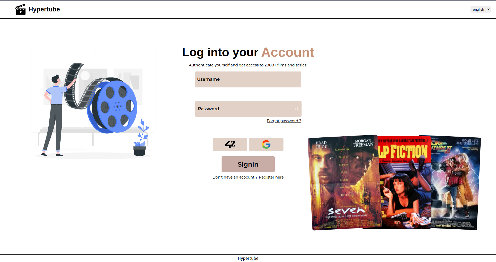
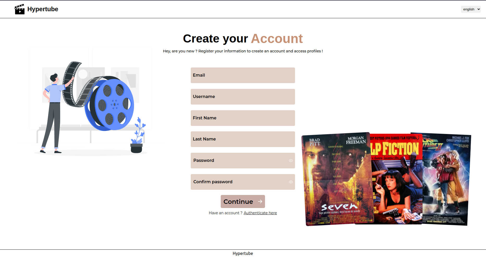
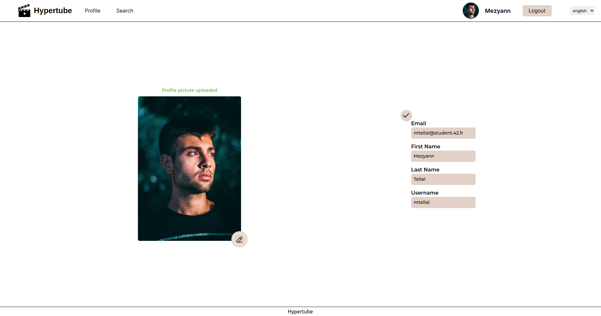
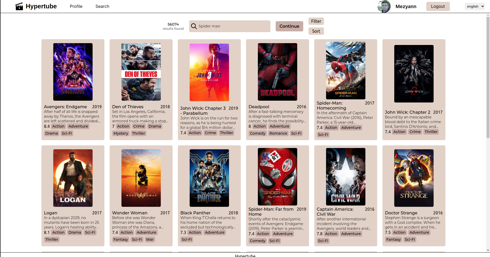
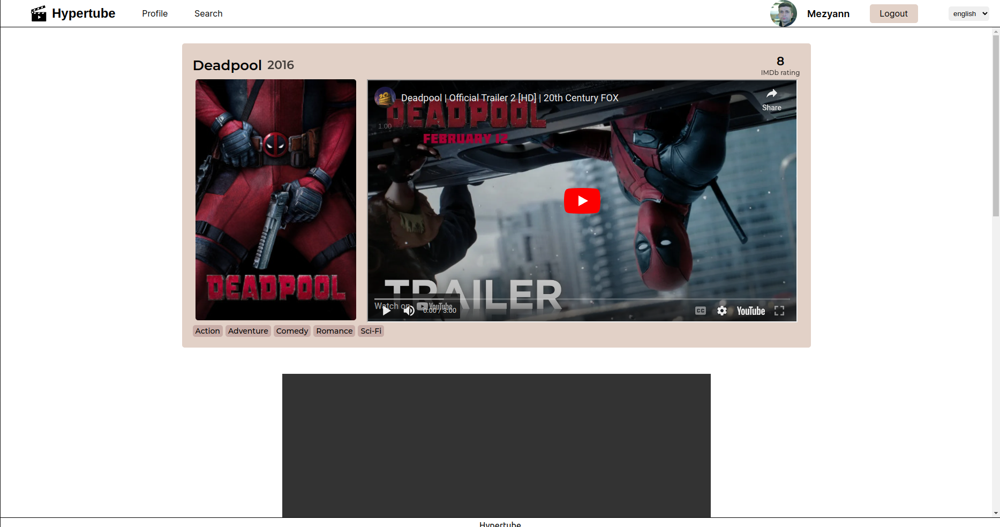
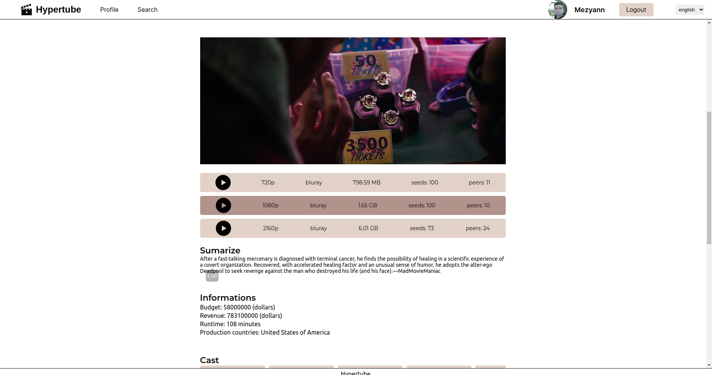
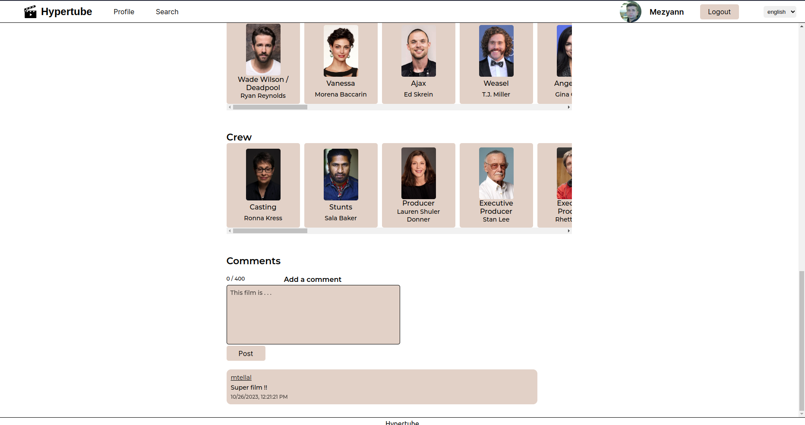

# Hypertube

## How to use

- Clone the repository `git clone https://github.com/mtellal/hypertube`
- Set 2 env files `./env` `./backend/.env`
- Run `docker compose up --build`    
- The frontend run on `http://localhost:8080`
- The backend api run on `http://localhost:3000`

### Environment file
In the `backend/.env` file set: 
- [Outlook](https://outlook.live.com/) `MAIL_ADDRESS` and `MAIL_PASSWORD` informations
- [42 Oauth](https://profile.intra.42.fr/oauth/applications) `SCHOOL42_CLIENT_ID`, `SCHOOL42_CLIENT_SECRET` and `SCHOOL42_REDIRECT_URI`
- [Google Oauth](https://console.cloud.google.com/) `GOOGLE_CLIENT_ID`, `GOOGLE_CLIENT_SECRET` and `GOOGLE_REDIRECT_URL` (with query string `google=true`)
- [The movieDB](https://developer.themoviedb.org/docs) is the second movie database used in this projet, set `MOVIEDB_TOKEN` 

## Frontend

### Stack 
- React
- Typescript
- Axios
- React router

### Functionalities 
- Signin and Signup Page
- Authentification via Oauth2 (42 and Google)
- Possibility to reset the password via email
- Update profile informations
- Thumbnails of movies loaded asynchronously
- Movies informations (date, tags, casts, seeds, ...)
- Differents torrents players available
- Seamless streaming experience
- Users can add comments and see their profiles
- Subtitles added 

## Backend

### Stack
- NodeJs
- Express
- Mariadb

### Functionalities
- Create and update users
- Movies informations fetched from two differents services (yts and themoviedb)
- Download and stream movies in the more efficient way
- Get users, comments and movies available

